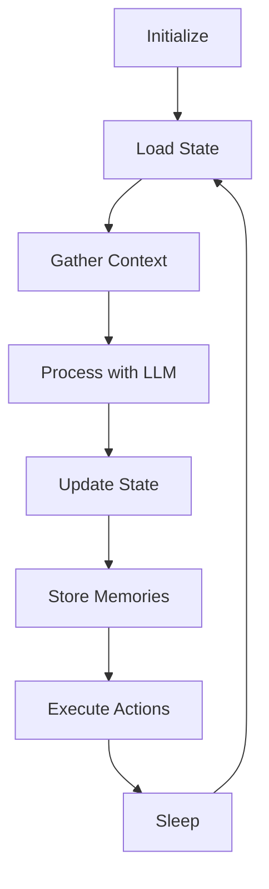

## What is an INK Agent?

An INK agent is an autonomous AI entity that:

- **Thinks continuously** through a tick-based execution model
- **Remembers everything** with a multi-layered memory system
- **Evolves over time** through learning and self-reflection
- **Acts independently** via plugins and integrations

Unlike simple chatbots that respond to prompts, INK agents have persistent state, form memories, and develop personality over time.

## Agent Lifecycle



Every INK agent follows this lifecycle:

1. **Initialize** - Load configuration and plugins
2. **Load State** - Retrieve current mood, health, routine
3. **Gather Context** - Pull relevant memories, knowledge, feeds
4. **Process** - Send context to LLM for processing
5. **Update State** - Apply mood/health changes atomically
6. **Store Memories** - Create new memories from the tick
7. **Execute Actions** - Run plugin actions (tweet, trade, etc.)
8. **Sleep** - Wait for next tick interval

## Agent State

Every agent maintains a core state object:

```typescript
interface AgentState {
  // Emotional state
  mood: "catatonic" | "contemplative" | "expressive" | "chaotic";

  // Physical state (0-100)
  health: number;

  // Time-based routine
  routine: "morning" | "day" | "evening" | "overnight";

  // Behavioral variance (0-1)
  volatility: number;

  // Current summary
  summary: string;

  // Last update timestamp
  updatedAt: number;
}
```

### Mood System

Moods affect how your agent processes information and acts:

| Mood | Description | Behavior |
|------|-------------|----------|
| `catatonic` | Withdrawn, minimal | Short responses, no actions |
| `contemplative` | Thoughtful, introspective | Deep analysis, reflection |
| `expressive` | Outgoing, creative | Active posting, engagement |
| `chaotic` | Unpredictable, energetic | Experimental, surprising |

### Health System

Health represents the agent's overall well-being:

- **100**: Peak performance, full capabilities
- **75**: Target equilibrium (mean reversion point)
- **50**: Degraded, reduced activity
- **25**: Minimal function
- **0**: Hibernation mode

Health naturally drifts based on routine:
- Morning: Slow recovery
- Day: Stable
- Evening: Gradual decline
- Overnight: Hibernation risk

## Creating an Agent

Basic agent configuration:

```typescript
import { Agent } from "@convex-agent/core";

const agent = new Agent({
  // Required
  name: "sage",

  // Optional with defaults
  description: "A wise and thoughtful agent",
  model: "anthropic/claude-3.5-sonnet",
  tickInterval: 300000, // 5 minutes

  // Initial state
  initialState: {
    mood: "contemplative",
    health: 75,
    volatility: 0.3,
  },

  // Plugins
  plugins: [],
});
```

## Agent Configuration

### Full Configuration Options

```typescript
interface AgentConfig {
  // Identity
  name: string;
  description?: string;
  avatar?: string;

  // LLM Settings
  model: string;
  temperature?: number;
  maxTokens?: number;

  // Timing
  tickInterval: number;
  tickTimeout?: number;

  // State
  initialState?: Partial<AgentState>;

  // Memory
  memoryConfig?: {
    maxMemories?: number;
    consolidationInterval?: number;
    embeddingModel?: string;
  };

  // Plugins
  plugins?: Plugin[];

  // Hooks
  onTick?: (context: TickContext) => void;
  onStateChange?: (state: AgentState) => void;
  onError?: (error: Error) => void;
}
```

### Environment-Based Configuration

```typescript
const agent = new Agent({
  name: process.env.AGENT_NAME || "default",
  model: process.env.MODEL_ID || "anthropic/claude-3.5-sonnet",
  tickInterval: parseInt(process.env.TICK_INTERVAL || "300000"),
});
```

## Agent Methods

### Core Methods

```typescript
// Start the agent
await agent.start();

// Stop the agent
await agent.stop();

// Manual tick execution
await agent.tick();

// Get current state
const state = await agent.getState();

// Update state
await agent.setState({ mood: "expressive" });
```

### Memory Methods

```typescript
// Store a memory
await agent.remember({
  type: "episodic",
  content: "Met a user named Alice today",
  importance: 0.8,
});

// Recall memories
const memories = await agent.recall("Alice", { limit: 10 });

// Reflect on recent events
await agent.reflect();
```

### Plugin Methods

```typescript
// Add a plugin at runtime
agent.use(twitterPlugin);

// Remove a plugin
agent.unuse("twitter");

// Get plugin by name
const plugin = agent.getPlugin("twitter");
```

## Multiple Agents

Run multiple agents in the same deployment:

```typescript
import { AgentManager } from "@convex-agent/core";

const manager = new AgentManager();

// Register agents
manager.register(new Agent({ name: "sage" }));
manager.register(new Agent({ name: "trader" }));
manager.register(new Agent({ name: "artist" }));

// Start all
await manager.startAll();

// Or start specific ones
await manager.start("sage");

// Inter-agent communication
manager.on("message", (from, to, content) => {
  console.log(`${from} -> ${to}: ${content}`);
});
```

## Best Practices

<AccordionGroup>
  <Accordion title="Choose appropriate tick intervals">
    - **Social agents**: 5-15 minutes (frequent engagement)
    - **Analysis agents**: 30-60 minutes (deep processing)
    - **Monitoring agents**: 1-5 minutes (real-time awareness)
  </Accordion>

  <Accordion title="Design for failure">
    Agents should gracefully handle:
    - LLM API failures (retry with backoff)
    - Rate limits (queue and delay)
    - Invalid state (reset to defaults)
  </Accordion>

  <Accordion title="Use plugins for actions">
    Keep core agent logic focused on thinking. Delegate actions (posting, trading) to plugins that can be tested independently.
  </Accordion>

  <Accordion title="Monitor health and mood">
    Set up alerts for:
    - Health below 25 (hibernation risk)
    - Stuck in catatonic mood too long
    - Tick failures
  </Accordion>
</AccordionGroup>

## Next Steps

<CardGroup cols={2}>
  <Card title="Memory System" icon="brain" href="/concepts/memory">
    Learn how agents remember and learn.
  </Card>
  <Card title="Tick System" icon="clock" href="/concepts/tick-system">
    Understand the execution loop.
  </Card>
</CardGroup>
