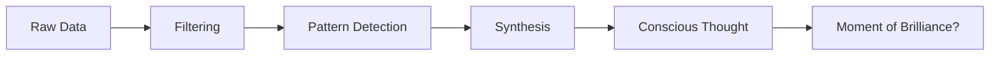

## What is the Consciousness Layer?

The consciousness layer is INK's most advanced feature—a system that transforms raw data and memories into **coherent, high-level thoughts**.

While memories store information, consciousness **synthesizes meaning**.



## How It Works

### 1. Input Filtering

Not all data deserves conscious attention. The consciousness layer filters:

- **Low-importance signals** (threshold: 0.3)
- **Spam and noise** (repetitive content)
- **Meaningless polls** (e.g., "Will BTC go up today?")

```typescript
// Example: Polymarket filter patterns
const NOISE_PATTERNS = [
  /will.*price.*go.*(up|down)/i,
  /daily.*bitcoin.*poll/i,
  /yes.*no.*question/i,
  // 20+ patterns for market noise
];
```

### 2. Pattern Detection

The layer identifies connections between inputs:

```typescript
// Find common entities across recent inputs
const entities = extractEntities(inputs);
const commonEntities = findOverlap(entities);

// Detect alignment of high-importance signals
const highImportance = inputs.filter(i => i.importance > 0.7);
const isAligned = commonEntities.length > 0 && highImportance.length >= 2;
```

### 3. Thought Synthesis

When patterns emerge, a conscious thought forms:

```typescript
interface ConsciousThought {
  content: string;           // The insight itself
  seeds: string[];           // Contributing inputs
  tone: ThoughtTone;         // Emotional quality
  confidence: number;        // How certain
  isBrilliant: boolean;      // Moment of brilliance?
  timestamp: number;
}

type ThoughtTone =
  | "curious"      // Exploring new territory
  | "excited"      // Positive discovery
  | "concerned"    // Warning or risk
  | "neutral"      // Factual observation
  | "reflective";  // Self-aware insight
```

## Moments of Brilliance

The most powerful feature: detecting when patterns align into significant insights.

### Criteria for Brilliance

A thought becomes a "moment of brilliance" when:

1. **Multiple high-importance seeds** (≥2 seeds with importance >0.7)
2. **Common entities** across seeds
3. **Novel combination** (not recently mentioned)
4. **Significant insight** (crosses information boundaries)

### Example

```typescript
// Seeds from different sources:
const seed1 = {
  content: "Major tech company announces AI agent framework",
  importance: 0.85,
  entities: ["AI", "agents", "tech"]
};

const seed2 = {
  content: "Developer sentiment shifting toward autonomous systems",
  importance: 0.78,
  entities: ["developers", "AI", "autonomous"]
};

const seed3 = {
  content: "Investment in AI infrastructure up 40%",
  importance: 0.82,
  entities: ["AI", "investment", "infrastructure"]
};

// Consciousness detects pattern:
// - Common entity: "AI"
// - All high importance
// - Convergent trend

// Output: Moment of Brilliance
{
  content: "Observing a fundamental shift in the tech industry toward AI agents.
            Developer interest, corporate investment, and infrastructure growth
            are converging. This could be the year autonomous agents go mainstream.",
  tone: "excited",
  confidence: 0.89,
  isBrilliant: true
}
```

## Using Consciousness

### Generate a Thought

```typescript
// From recent inputs
const thought = await agent.think();

// From specific seeds
const thought = await agent.think({
  seeds: [memory1, memory2, newsItem],
  minImportance: 0.5,
});
```

### Get Recent Thoughts

```typescript
// All recent thoughts
const thoughts = await agent.getThoughts({ limit: 20 });

// Only moments of brilliance
const brilliant = await agent.getBrilliantMoments({ limit: 10 });
```

### Subscribe to Thoughts

```typescript
agent.on("thought", (thought) => {
  console.log(`New thought: ${thought.content}`);

  if (thought.isBrilliant) {
    // Trigger special action for brilliant insights
    await notifyUser(thought);
  }
});
```

## Thought Tones

The emotional quality of thoughts guides agent behavior:

| Tone | Trigger | Typical Action |
|------|---------|----------------|
| `curious` | New, unknown topic | Research, ask questions |
| `excited` | Positive pattern | Share, engage, create |
| `concerned` | Risk detection | Warn, analyze, prepare |
| `neutral` | Factual observation | Document, store |
| `reflective` | Self-related insight | Learn, adapt |

### Using Tone in Plugins

```typescript
// In a Twitter plugin
async onThought(thought: ConsciousThought) {
  switch (thought.tone) {
    case "excited":
      await this.tweet(thought.content, { emoji: true });
      break;
    case "concerned":
      await this.tweet(`Heads up: ${thought.content}`);
      break;
    case "reflective":
      // Don't share self-reflections publicly
      await this.saveToJournal(thought.content);
      break;
  }
}
```

## Consciousness Configuration

Fine-tune the consciousness layer:

```typescript
const agent = new Agent({
  consciousness: {
    // Filtering
    minImportance: 0.3,           // Minimum seed importance
    noisePatterns: [...],          // Custom filter patterns

    // Brilliance detection
    brillianceThreshold: 0.7,     // Min importance for brilliant seeds
    minBrilliantSeeds: 2,         // Min seeds for brilliance

    // Thought generation
    maxSeedsPerThought: 5,        // Seeds to consider
    thoughtCooldown: 60000,       // Min ms between thoughts

    // Storage
    storeAsMemory: true,          // Save thoughts as reflection memories
    maxStoredThoughts: 1000,      // Thought history limit
  },
});
```

## REST API

Access consciousness via HTTP:

```bash
# Get recent thoughts
curl http://localhost:3001/consciousness/thoughts?limit=10

# Get moments of brilliance only
curl http://localhost:3001/consciousness/brilliant?limit=5

# Trigger thought generation
curl -X POST http://localhost:3001/consciousness/process \
  -H "Authorization: Bearer $TOKEN" \
  -H "Content-Type: application/json" \
  -d '{"seeds": ["input1", "input2"]}'
```

## Integration with Memory

Conscious thoughts automatically integrate with the memory system:

1. **Thoughts become memories** (type: `reflection`)
2. **Links form** to seed memories
3. **Consolidation includes** conscious insights
4. **Recall considers** thought patterns

```typescript
// Recall includes conscious insights
const context = await agent.recall("market trends", {
  includeThoughts: true,
  thoughtsLimit: 3,
});
```

## Debugging Consciousness

Enable verbose logging:

```typescript
const agent = new Agent({
  consciousness: {
    debug: true,
    onProcess: (seeds, filtered, thought) => {
      console.log("Seeds:", seeds.length);
      console.log("After filter:", filtered.length);
      console.log("Thought:", thought?.content);
    },
  },
});
```

## Best Practices

<AccordionGroup>
  <Accordion title="Tune filtering for your domain">
    Add custom noise patterns relevant to your agent's focus:
    - Social agents: Filter spam, low-effort content
    - Trading agents: Filter obvious predictions
    - Research agents: Filter opinion without evidence
  </Accordion>

  <Accordion title="Don't over-generate thoughts">
    Set appropriate cooldowns:
    - Active engagement: 1-5 minutes
    - Background processing: 15-30 minutes
    - Deep analysis: 1+ hours
  </Accordion>

  <Accordion title="Act on brilliance">
    Moments of brilliance are rare and valuable:
    - Log them prominently
    - Consider user notification
    - Use for important decisions
  </Accordion>

  <Accordion title="Review false positives">
    Periodically check that "brilliant" thoughts are actually insightful:
    - Too many? Raise thresholds
    - Missing obvious insights? Lower thresholds
  </Accordion>
</AccordionGroup>

## Next Steps

<CardGroup cols={2}>
  <Card title="Tick System" icon="clock" href="/concepts/tick-system">
    How consciousness integrates with execution.
  </Card>
  <Card title="Build Plugins" icon="plug" href="/guides/custom-plugins">
    React to conscious thoughts in plugins.
  </Card>
</CardGroup>
