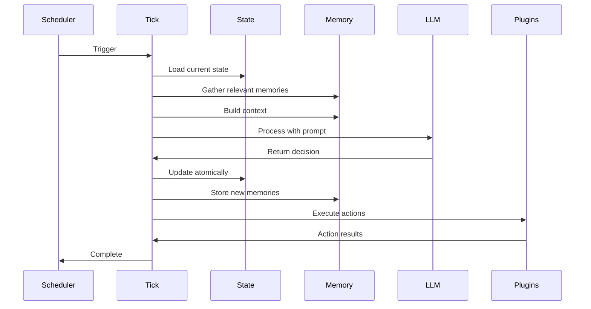

## What is a Tick?

A **tick** is a single execution cycle of your agent. Think of it as the agent's heartbeat—a regular interval where it:

1. Wakes up and loads state
2. Gathers context and memories
3. Processes through the LLM
4. Updates state and creates memories
5. Executes actions via plugins
6. Returns to sleep

This tick-based model enables **true autonomy**—your agent runs continuously without requiring user interaction.

## Tick Lifecycle



## Tick Phases

### Phase 1: State Loading

```typescript
// Load singleton state
const state = await ctx.runQuery(api.state.getState);

// {
//   mood: "contemplative",
//   health: 72,
//   routine: "day",
//   volatility: 0.35,
//   summary: "Processing market data...",
//   updatedAt: 1706400000000
// }
```

### Phase 2: Context Building

```typescript
// Calculate routine based on time
const routine = calculateRoutine(new Date());

// Gather relevant memories
const memories = await memory.buildContext({
  query: state.summary,
  maxTokens: 2000,
  includeTypes: ["episodic", "semantic", "emotional"],
});

// Get recent knowledge/feeds
const knowledge = await ctx.runQuery(api.knowledge.recent, {
  limit: 10,
  routine: routine,
});

// Get recent logs for continuity
const logs = await ctx.runQuery(api.logs.recent, { limit: 5 });
```

### Phase 3: LLM Processing

```typescript
// Build the prompt
const prompt = buildPrompt({
  state,
  routine,
  memories,
  knowledge,
  logs,
});

// Call LLM via OpenRouter
const response = await callLLM({
  model: config.model,
  messages: [
    { role: "system", content: systemPrompt },
    { role: "user", content: prompt },
  ],
  response_format: { type: "json_object" },
});

// Expected response structure
interface TickResponse {
  mood: string;
  health: number;
  volatility: number;
  summary: string;
  detail: string;
  remark?: string;      // Optional personality flourish
  artifacts?: Artifact[];
}
```

### Phase 4: State Update

```typescript
// Atomic state update with health drift
await ctx.runMutation(api.tick.commitTickResult, {
  mood: response.mood,
  health: calculateHealthDrift(response.health, routine),
  volatility: response.volatility,
  summary: response.summary,
  detail: response.detail,
});

// Health drift based on routine:
// - morning: +2 recovery
// - day: ±0 stable
// - evening: -1 decline
// - overnight: -3 hibernation risk
```

### Phase 5: Memory Storage

```typescript
// Store tick as episodic memory
await memory.store({
  type: "episodic",
  content: response.detail,
  importance: calculateImportance(response),
  metadata: {
    mood: response.mood,
    routine: routine,
    trigger: "tick",
  },
});

// If remark exists, may trigger reflection
if (response.remark) {
  await consciousness.process([response.remark]);
}
```

### Phase 6: Plugin Execution

```typescript
// Build tick context for plugins
const tickContext: TickContext = {
  state: newState,
  response,
  memories,
  knowledge,
  routine,
};

// Execute plugin hooks
for (const plugin of agent.plugins) {
  if (plugin.onTick) {
    await plugin.onTick(tickContext);
  }
}
```

## Routine System

The routine determines the agent's behavioral context:

```typescript
function calculateRoutine(date: Date): Routine {
  const hour = date.getHours();

  if (hour >= 6 && hour < 12) return "morning";
  if (hour >= 12 && hour < 18) return "day";
  if (hour >= 18 && hour < 23) return "evening";
  return "overnight";
}
```

### Routine Behaviors

| Routine | Hours | Health Drift | Typical Behavior |
|---------|-------|--------------|------------------|
| Morning | 6-12 | +2 | Waking up, reviewing, planning |
| Day | 12-18 | ±0 | Active engagement, processing |
| Evening | 18-23 | -1 | Winding down, reflecting |
| Overnight | 23-6 | -3 | Minimal activity, maintenance |

## Tick Configuration

### Basic Configuration

```typescript
const agent = new Agent({
  tickInterval: 300000,  // 5 minutes
  tickTimeout: 60000,    // 1 minute max
});
```

### Advanced Configuration

```typescript
const agent = new Agent({
  tick: {
    interval: 300000,
    timeout: 60000,

    // Retry behavior
    maxRetries: 3,
    retryDelay: 5000,

    // Health thresholds
    hibernationThreshold: 10,
    minHealthForAction: 25,

    // Context building
    maxMemoryTokens: 2000,
    maxKnowledgeItems: 10,
    maxLogHistory: 5,

    // Hooks
    beforeTick: async (ctx) => { /* pre-tick logic */ },
    afterTick: async (ctx, result) => { /* post-tick logic */ },
    onError: async (error) => { /* error handling */ },
  },
});
```

## Triggering Ticks

### Automatic (Scheduled)

Using Convex crons:

```typescript
// convex/crons.ts
import { cronJobs } from "convex/server";

const crons = cronJobs();

// Every 5 minutes
crons.interval("agent tick", { minutes: 5 }, api.tick.run);

export default crons;
```

### Manual (HTTP)

```bash
curl -X POST http://localhost:3001/tick \
  -H "Authorization: Bearer $TICK_TOKEN"
```

### Programmatic

```typescript
// Direct tick execution
await agent.tick();

// Or via Convex action
await ctx.runAction(api.tick.runTick);
```

## Tick Context

The `TickContext` passed to plugins contains:

```typescript
interface TickContext {
  // Current agent state
  state: AgentState;

  // Retrieved memories for this tick
  memories: Memory[];

  // Retrieved knowledge items
  knowledge: Knowledge[];

  // Recent activity logs
  recentLogs: Log[];
}

interface AgentState {
  mood: Mood;
  health: number;
  routine: Routine;
  volatility: number;
  counters: { ticks: number; feeds: number };
  lastTick: string | null;
  cryo: boolean;
}
```

## Artifacts

Ticks can produce artifacts—outputs beyond state changes:

```typescript
interface Artifact {
  type: "tweet" | "image" | "trade" | "message" | "custom";
  content: any;
  metadata?: Record<string, any>;
}

// Example: Tweet artifact
{
  type: "tweet",
  content: "Observing interesting patterns in the market today...",
  metadata: {
    replyTo: null,
    mediaIds: [],
  }
}
```

Plugins consume artifacts:

```typescript
const twitterPlugin: Plugin = {
  name: "twitter",

  async onTick(context: TickContext) {
    const tweets = context.artifacts.filter(a => a.type === "tweet");

    for (const tweet of tweets) {
      await this.postTweet(tweet.content, tweet.metadata);
    }
  },
};
```

## Error Handling

### Tick Failures

```typescript
const agent = new Agent({
  tick: {
    onError: async (error, context) => {
      // Log the error
      console.error("Tick failed:", error);

      // Optionally reduce health
      await context.setState({
        health: context.state.health - 5,
        summary: "Recovering from processing error",
      });

      // Notify monitoring
      await alerting.send({
        level: "error",
        message: `Agent tick failed: ${error.message}`,
      });
    },
  },
});
```

### Hibernation

When health drops too low:

```typescript
// In tick execution
if (state.health < config.hibernationThreshold) {
  await ctx.runMutation(api.tick.enterHibernation, {
    reason: "Health critical",
  });

  // Skip normal tick processing
  return {
    mood: "catatonic",
    health: state.health,
    summary: "In hibernation mode",
    detail: "Conserving energy until health recovers",
  };
}
```

## Monitoring Ticks

### Tick Metrics

```typescript
// Get tick statistics
const stats = await agent.getTickStats();

// {
//   totalTicks: 1523,
//   successRate: 0.98,
//   avgDuration: 2340,  // ms
//   lastTick: 1706400000000,
//   ticksToday: 45,
//   failuresLast24h: 3,
// }
```

### Logging

```typescript
// Access tick logs
const logs = await ctx.runQuery(api.logs.list, {
  limit: 100,
  filter: { routine: "day" },
});
```

## Best Practices

<AccordionGroup>
  <Accordion title="Choose appropriate intervals">
    Balance responsiveness with cost:
    - Real-time agents: 1-5 minutes
    - Social agents: 5-15 minutes
    - Analysis agents: 30-60 minutes
    - Background agents: 1-6 hours
  </Accordion>

  <Accordion title="Set proper timeouts">
    Prevent stuck ticks:
    - LLM timeout: 30-60 seconds
    - Plugin timeout: 10-30 seconds
    - Total tick timeout: 2-3 minutes
  </Accordion>

  <Accordion title="Handle failures gracefully">
    - Implement retries with exponential backoff
    - Degrade gracefully (reduce activity, not crash)
    - Alert on repeated failures
  </Accordion>

  <Accordion title="Monitor health trends">
    Set up dashboards tracking:
    - Health over time
    - Mood distribution
    - Tick success rate
    - Action frequency
  </Accordion>
</AccordionGroup>

## Next Steps

<CardGroup cols={2}>
  <Card title="Build Plugins" icon="plug" href="/guides/custom-plugins">
    React to ticks with custom logic.
  </Card>
  <Card title="Deployment" icon="rocket" href="/guides/deployment">
    Deploy your ticking agent.
  </Card>
</CardGroup>
