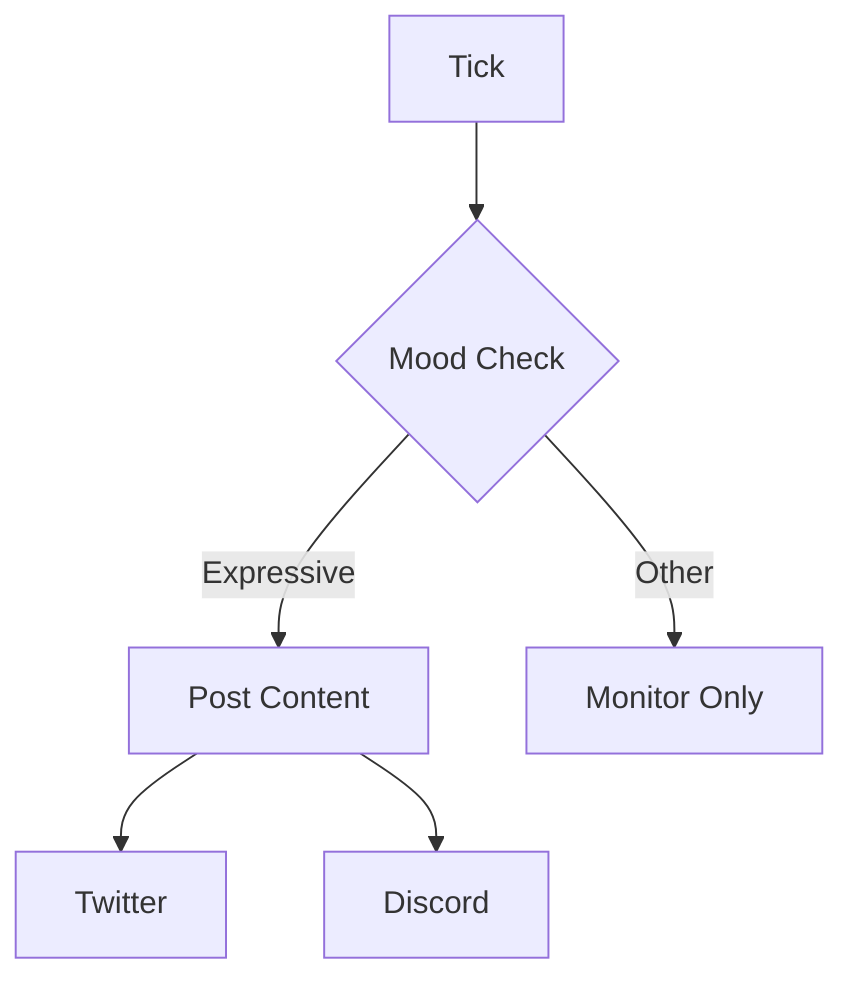

This example shows how to build a social media agent that:
- Posts content based on agent mood
- Implements cooldown timers between posts
- Responds to mentions when in certain moods

## Architecture



## Social Plugin

```typescript
// plugins/social.ts
import type { Plugin, TickContext } from "./src";
import type { Agent } from "./src";

interface SocialConfig {
  postCooldownMinutes: number;
  platforms: string[];
}

export function createSocialPlugin(config: SocialConfig): Plugin {
  let lastPostTime = 0;

  const canPost = (): boolean => {
    return Date.now() - lastPostTime > config.postCooldownMinutes * 60 * 1000;
  };

  return {
    name: "social",
    version: "1.0.0",

    init(agent: Agent) {
      console.log(`Social plugin initialized for platforms: ${config.platforms.join(", ")}`);
    },

    onTick(context: TickContext) {
      // Only post when expressive and healthy
      if (context.state.mood === "expressive" && context.state.health > 50) {
        if (canPost()) {
          console.log("Agent is expressive - ready to post content");
          // In a real implementation, you would call your posting logic here
        } else {
          console.log("Post cooldown active");
        }
      }

      // Log current mood for monitoring
      console.log(`Social plugin tick - Mood: ${context.state.mood}`);
    },

    actions: {
      async post(params: { content: string; platform: string }, agent: Agent) {
        if (!canPost()) {
          return { success: false, error: "Cooldown active" };
        }

        // Validate platform
        if (!config.platforms.includes(params.platform)) {
          return { success: false, error: "Platform not configured" };
        }

        // Your posting logic here (Twitter API, Discord bot, etc.)
        console.log(`Posting to ${params.platform}: ${params.content}`);

        lastPostTime = Date.now();
        return { success: true, platform: params.platform };
      },

      async getStatus() {
        return {
          success: true,
          data: {
            lastPostTime,
            cooldownRemaining: Math.max(0,
              config.postCooldownMinutes * 60 * 1000 - (Date.now() - lastPostTime)
            ),
            canPost: canPost(),
          }
        };
      },
    },
  };
}
```

## Logger Plugin

A simple plugin to track agent activity:

```typescript
// plugins/logger.ts
import type { Plugin, TickContext } from "./src";

export const loggerPlugin: Plugin = {
  name: "logger",
  version: "1.0.0",

  onTick(context: TickContext) {
    const { state, memories, recentLogs } = context;

    console.log(`--- Tick Summary ---`);
    console.log(`Mood: ${state.mood}`);
    console.log(`Health: ${state.health}`);
    console.log(`Routine: ${state.routine}`);
    console.log(`Memories loaded: ${memories.length}`);
    console.log(`Recent logs: ${recentLogs.length}`);
  }
};
```

## Complete Setup

```typescript
// agent.ts
import { Agent } from "./src";
import { ConvexBackend } from "./src/backend";
import { createSocialPlugin } from "./plugins/social";
import { loggerPlugin } from "./plugins/logger";

const backend = new ConvexBackend({
  url: process.env.CONVEX_URL!,
});

export const socialAgent = new Agent({
  backend,
  plugins: [
    loggerPlugin,

    createSocialPlugin({
      postCooldownMinutes: 60,  // 1 hour between posts
      platforms: ["twitter", "discord"],
    }),
  ],
});

// Execute a single tick
await socialAgent.tick();

// Or start automatic tick execution
socialAgent.start();

// Execute a plugin action
await socialAgent.executeAction("social", "post", {
  content: "Hello from ClarkOS!",
  platform: "twitter"
});

// Get plugin status
const status = await socialAgent.executeAction("social", "getStatus", {});
console.log(status);
```

## Running the Agent

```bash
# Start the agent
npm run dev

# The agent will tick automatically based on your configuration
# Check the console for social plugin activity logs
```

## Best Practices

<AccordionGroup>
  <Accordion title="Respect rate limits">
    - Twitter: Max 300 tweets/3 hours
    - Discord: Max 5 messages/5 seconds per channel
    - Build in cooldowns between posts
  </Accordion>

  <Accordion title="Use mood-based posting">
    - Only post when mood is "expressive"
    - Reduce activity when health is low
    - Quality over quantity
  </Accordion>

  <Accordion title="Log everything">
    - Track all posts and their outcomes
    - Monitor cooldown timers
    - Use the logger plugin during development
  </Accordion>
</AccordionGroup>

## Next Steps

<CardGroup cols={2}>
  <Card title="Basic Agent" icon="robot" href="/examples/basic-agent">
    Review the basics.
  </Card>
  <Card title="Plugin Development" icon="plug" href="/guides/custom-plugins">
    Build custom integrations.
  </Card>
</CardGroup>
