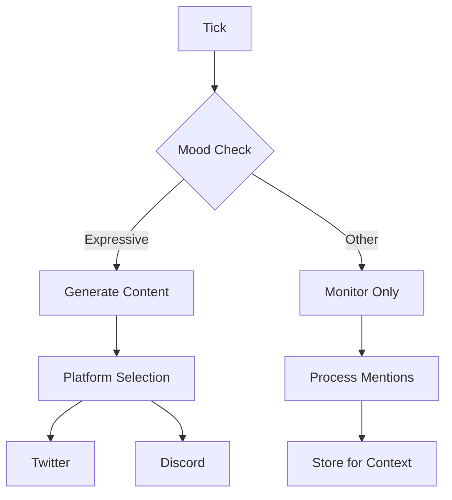

This example shows how to build a social media agent that:
- Posts thoughtful content on Twitter
- Responds to Discord community
- Manages its online presence autonomously

## Architecture



## Multi-Platform Plugin

```typescript
// plugins/social.ts
import { Plugin, TickContext } from "@convex-agent/core";

interface SocialConfig {
  twitter?: {
    enabled: boolean;
    postCooldownMinutes: number;
    replyEnabled: boolean;
  };
  discord?: {
    enabled: boolean;
    channelId: string;
    respondToMentions: boolean;
  };
}

export function createSocialPlugin(config: SocialConfig): Plugin {
  const lastPost: Record<string, number> = {};

  return {
    name: "social",
    version: "1.0.0",
    dependencies: ["twitter", "discord"],

    async onTick(context: TickContext) {
      // Process based on mood
      switch (context.state.mood) {
        case "expressive":
          await this.handleExpressive(context);
          break;
        case "contemplative":
          await this.handleContemplative(context);
          break;
        default:
          // Minimal activity
          break;
      }
    },

    async handleExpressive(context: TickContext) {
      // Check for brilliant thoughts to share
      const thought = context.getRecentThought();

      if (thought?.isBrilliant && thought.confidence > 0.8) {
        // Share on Twitter
        if (this.canPost("twitter", config.twitter?.postCooldownMinutes || 30)) {
          await this.postToTwitter(thought.content, context);
        }

        // Share on Discord
        if (config.discord?.enabled) {
          await this.postToDiscord(thought.content, context);
        }
      } else if (context.response.remark) {
        // Share casual remark on Twitter
        if (this.canPost("twitter", config.twitter?.postCooldownMinutes || 30)) {
          await this.postToTwitter(context.response.remark, context);
        }
      }
    },

    async handleContemplative(context: TickContext) {
      // In contemplative mood, respond to mentions but don't initiate
      if (config.twitter?.replyEnabled) {
        await this.processTwitterMentions(context);
      }

      if (config.discord?.respondToMentions) {
        await this.processDiscordMentions(context);
      }
    },

    canPost(platform: string, cooldownMinutes: number): boolean {
      const last = lastPost[platform] || 0;
      return Date.now() - last > cooldownMinutes * 60 * 1000;
    },

    async postToTwitter(content: string, context: TickContext) {
      const twitter = context.getPlugin("twitter");

      // Ensure content fits Twitter
      const tweet = content.length > 280
        ? content.substring(0, 277) + "..."
        : content;

      try {
        const result = await twitter.actions.post(tweet);
        lastPost["twitter"] = Date.now();

        await context.remember({
          type: "episodic",
          content: `Posted to Twitter: "${tweet}"`,
          importance: 0.6,
          metadata: {
            platform: "twitter",
            tweetId: result.tweetId,
          },
        });

        context.emit("social_post", {
          platform: "twitter",
          content: tweet,
          id: result.tweetId,
        });
      } catch (error) {
        console.error("Twitter post failed:", error);
      }
    },

    async postToDiscord(content: string, context: TickContext) {
      const discord = context.getPlugin("discord");

      try {
        await discord.actions.sendMessage(config.discord!.channelId, content);

        await context.remember({
          type: "episodic",
          content: `Posted to Discord: "${content}"`,
          importance: 0.5,
          metadata: { platform: "discord" },
        });
      } catch (error) {
        console.error("Discord post failed:", error);
      }
    },

    async processTwitterMentions(context: TickContext) {
      const twitter = context.getPlugin("twitter");
      const mentions = await twitter.actions.getMentions();

      for (const mention of mentions) {
        // Skip if already replied
        const alreadyReplied = await this.checkIfReplied(mention.id, context);
        if (alreadyReplied) continue;

        // Generate reply based on mention content
        const reply = await this.generateReply(mention.text, context);
        if (reply) {
          await twitter.actions.reply(mention.id, reply);

          await context.remember({
            type: "episodic",
            content: `Replied to @${mention.author}: "${reply}"`,
            importance: 0.65,
            metadata: {
              platform: "twitter",
              inReplyTo: mention.id,
              author: mention.author,
            },
          });
        }
      }
    },

    async generateReply(mentionText: string, context: TickContext): Promise<string | null> {
      // Recall relevant memories
      const relevant = await context.recall(mentionText, { limit: 3 });

      // If we have relevant knowledge, craft a reply
      if (relevant.length > 0 && context.state.health > 30) {
        // In a real implementation, you'd use the LLM here
        // For now, return null to indicate no reply
        return null;
      }

      return null;
    },

    async checkIfReplied(mentionId: string, context: TickContext): Promise<boolean> {
      const memories = await context.recall(`replied to ${mentionId}`, { limit: 1 });
      return memories.length > 0;
    },

    actions: {
      async getStats() {
        return {
          lastTwitterPost: lastPost["twitter"],
          lastDiscordPost: lastPost["discord"],
        };
      },

      async forcePost(platform: string, content: string) {
        if (platform === "twitter") {
          return await this.postToTwitter(content, this.context);
        } else if (platform === "discord") {
          return await this.postToDiscord(content, this.context);
        }
      },
    },
  };
}
```

## Content Generation

```typescript
// plugins/content.ts
import { Plugin, TickContext } from "@convex-agent/core";

interface ContentConfig {
  topics: string[];
  style: "casual" | "professional" | "witty";
  maxLength: number;
}

export function createContentPlugin(config: ContentConfig): Plugin {
  return {
    name: "content",
    version: "1.0.0",

    async generatePost(context: TickContext): Promise<string | null> {
      // Get recent thoughts and memories
      const thoughts = await context.getThoughts({ limit: 3 });
      const memories = await context.recall(config.topics.join(" "), { limit: 5 });

      // Find the most interesting content
      const brilliant = thoughts.find(t => t.isBrilliant);
      if (brilliant) {
        return this.styleContent(brilliant.content, config.style);
      }

      // Fall back to recent thought
      if (thoughts.length > 0 && thoughts[0].confidence > 0.7) {
        return this.styleContent(thoughts[0].content, config.style);
      }

      return null;
    },

    styleContent(content: string, style: string): string {
      // Apply style transformations
      let styled = content;

      if (style === "casual") {
        // Make more conversational
        styled = styled.replace(/I observe/g, "noticing");
        styled = styled.replace(/It appears/g, "looks like");
      } else if (style === "witty") {
        // Could add wit here in production
      }

      // Ensure length limit
      if (styled.length > config.maxLength) {
        styled = styled.substring(0, config.maxLength - 3) + "...";
      }

      return styled;
    },

    actions: {
      async generateThread(topic: string, length: number) {
        const memories = await this.context.recall(topic, { limit: 10 });
        // Generate thread from memories
        return memories.map(m => m.content.substring(0, 280));
      },
    },
  };
}
```

## Complete Setup

```typescript
// convex/agent.ts
import { Agent } from "@convex-agent/core";
import { twitterPlugin } from "@ink/plugin-twitter";
import { discordPlugin } from "@ink/plugin-discord";
import { createSocialPlugin } from "./plugins/social";
import { createContentPlugin } from "./plugins/content";

export const socialAgent = new Agent({
  name: "sage",
  description: "A thoughtful voice in the crypto community",

  model: "anthropic/claude-3.5-sonnet",
  tickInterval: 10 * 60 * 1000,  // 10 minutes

  initialState: {
    mood: "contemplative",
    health: 85,
    volatility: 0.3,
  },

  plugins: [
    twitterPlugin({
      apiKey: process.env.TWITTER_API_KEY!,
      apiSecret: process.env.TWITTER_API_SECRET!,
      accessToken: process.env.TWITTER_ACCESS_TOKEN!,
      accessSecret: process.env.TWITTER_ACCESS_SECRET!,
    }),

    discordPlugin({
      token: process.env.DISCORD_BOT_TOKEN!,
      guildId: process.env.DISCORD_GUILD_ID!,
    }),

    createContentPlugin({
      topics: ["crypto", "AI", "technology", "markets"],
      style: "witty",
      maxLength: 280,
    }),

    createSocialPlugin({
      twitter: {
        enabled: true,
        postCooldownMinutes: 60,
        replyEnabled: true,
      },
      discord: {
        enabled: true,
        channelId: process.env.DISCORD_CHANNEL_ID!,
        respondToMentions: true,
      },
    }),
  ],
});

// Monitor social activity
socialAgent.on("social_post", (data) => {
  console.log(`Posted to ${data.platform}: ${data.content}`);
});

socialAgent.on("brilliantMoment", async (thought) => {
  // Brilliant thoughts always get shared
  console.log(`Brilliant insight ready to share: ${thought.content}`);
});
```

## Best Practices for Social Agents

<AccordionGroup>
  <Accordion title="Respect rate limits">
    - Twitter: Max 300 tweets/3 hours
    - Discord: Max 5 messages/5 seconds per channel
    - Build in cooldowns between posts
  </Accordion>

  <Accordion title="Maintain authenticity">
    - Let the agent's personality shine through
    - Don't force engagement when mood is catatonic
    - Quality over quantity
  </Accordion>

  <Accordion title="Handle negative interactions">
    - Don't engage with trolls
    - Store negative interactions as memories to learn
    - Reduce health on harassment
  </Accordion>

  <Accordion title="Monitor and adjust">
    - Track engagement metrics
    - Adjust posting frequency based on response
    - Learn from what resonates
  </Accordion>
</AccordionGroup>

## Next Steps

<CardGroup cols={2}>
  <Card title="Basic Agent" icon="robot" href="/examples/basic-agent">
    Review the basics.
  </Card>
  <Card title="Plugin Development" icon="plug" href="/guides/custom-plugins">
    Build custom integrations.
  </Card>
</CardGroup>
