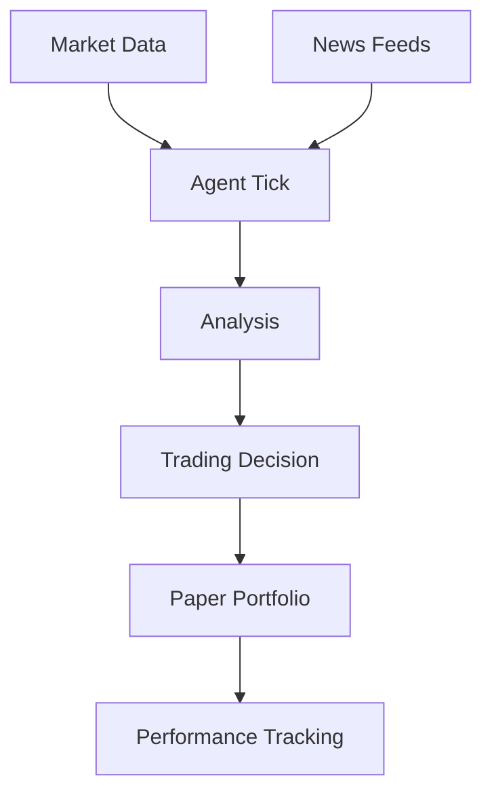

This example shows how to build a trading agent that:
- Monitors cryptocurrency markets
- Forms opinions based on news and data
- Makes paper trading decisions
- Tracks portfolio performance

## Architecture



## Key Components

### Market Data Plugin

```typescript
// plugins/markets.ts
import { Plugin, TickContext } from "@convex-agent/core";

interface MarketData {
  symbol: string;
  price: number;
  change24h: number;
  volume: number;
}

export function createMarketsPlugin(config: {
  symbols: string[];
  refreshMinutes: number;
}): Plugin {
  let lastFetch = 0;
  let cachedData: MarketData[] = [];

  return {
    name: "markets",
    version: "1.0.0",

    async init(agent) {
      // Initial fetch
      cachedData = await fetchMarketData(config.symbols);
      lastFetch = Date.now();
    },

    async onTick(context: TickContext) {
      // Refresh if stale
      if (Date.now() - lastFetch > config.refreshMinutes * 60 * 1000) {
        cachedData = await fetchMarketData(config.symbols);
        lastFetch = Date.now();
      }

      // Store as knowledge
      for (const data of cachedData) {
        await context.remember({
          type: "semantic",
          content: `${data.symbol}: $${data.price} (${data.change24h > 0 ? "+" : ""}${data.change24h.toFixed(2)}%)`,
          importance: Math.abs(data.change24h) > 5 ? 0.8 : 0.5,
          metadata: {
            type: "market_data",
            symbol: data.symbol,
            price: data.price,
            change: data.change24h,
          },
        });
      }
    },

    actions: {
      async getMarkets() {
        return cachedData;
      },

      async getPrice(symbol: string) {
        const data = cachedData.find(d => d.symbol === symbol);
        return data?.price || null;
      },
    },
  };
}

async function fetchMarketData(symbols: string[]): Promise<MarketData[]> {
  const response = await fetch(
    `https://api.coingecko.com/api/v3/coins/markets?vs_currency=usd&ids=${symbols.join(",")}`
  );
  const data = await response.json();
  return data.map((coin: any) => ({
    symbol: coin.symbol.toUpperCase(),
    price: coin.current_price,
    change24h: coin.price_change_percentage_24h,
    volume: coin.total_volume,
  }));
}
```

### Paper Trading Plugin

```typescript
// plugins/paper-trading.ts
import { Plugin, TickContext } from "@convex-agent/core";

interface Position {
  symbol: string;
  amount: number;
  entryPrice: number;
  entryTime: number;
}

interface Portfolio {
  cash: number;
  positions: Position[];
}

export function createPaperTradingPlugin(config: {
  initialCash: number;
  maxPositionPercent: number;
}): Plugin {
  let portfolio: Portfolio = {
    cash: config.initialCash,
    positions: [],
  };

  return {
    name: "paper-trading",
    version: "1.0.0",
    dependencies: ["markets"],

    async onTick(context: TickContext) {
      // Only trade when expressive and healthy
      if (context.state.mood !== "expressive" || context.state.health < 50) {
        return;
      }

      // Get recent thoughts for trading signals
      const thought = context.getRecentThought();
      if (!thought || thought.confidence < 0.7) {
        return;
      }

      // Analyze thought for trading intent
      const signal = analyzeForSignal(thought.content);
      if (!signal) return;

      // Get current price
      const markets = context.getPlugin("markets");
      const price = await markets.actions.getPrice(signal.symbol);
      if (!price) return;

      // Execute trade
      if (signal.direction === "buy") {
        await this.executeBuy(signal.symbol, price, context);
      } else if (signal.direction === "sell") {
        await this.executeSell(signal.symbol, price, context);
      }
    },

    async executeBuy(symbol: string, price: number, context: TickContext) {
      const maxAmount = portfolio.cash * config.maxPositionPercent;
      const amount = maxAmount / price;

      if (amount * price > portfolio.cash) {
        return { success: false, reason: "Insufficient funds" };
      }

      portfolio.cash -= amount * price;
      portfolio.positions.push({
        symbol,
        amount,
        entryPrice: price,
        entryTime: Date.now(),
      });

      await context.remember({
        type: "episodic",
        content: `Bought ${amount.toFixed(4)} ${symbol} at $${price}`,
        importance: 0.8,
        metadata: { type: "trade", action: "buy", symbol, amount, price },
      });

      context.emit("trade_executed", {
        action: "buy",
        symbol,
        amount,
        price,
      });

      return { success: true, amount, price };
    },

    async executeSell(symbol: string, price: number, context: TickContext) {
      const position = portfolio.positions.find(p => p.symbol === symbol);
      if (!position) {
        return { success: false, reason: "No position" };
      }

      const proceeds = position.amount * price;
      const pnl = proceeds - (position.amount * position.entryPrice);
      const pnlPercent = (pnl / (position.amount * position.entryPrice)) * 100;

      portfolio.cash += proceeds;
      portfolio.positions = portfolio.positions.filter(p => p.symbol !== symbol);

      await context.remember({
        type: "episodic",
        content: `Sold ${position.amount.toFixed(4)} ${symbol} at $${price} (${pnlPercent > 0 ? "+" : ""}${pnlPercent.toFixed(2)}% PnL)`,
        importance: 0.85,
        metadata: { type: "trade", action: "sell", symbol, price, pnl, pnlPercent },
      });

      return { success: true, pnl, pnlPercent };
    },

    actions: {
      async getPortfolio() {
        const markets = this.agent.getPlugin("markets");
        const marketData = await markets.actions.getMarkets();

        const positionsWithValue = portfolio.positions.map(pos => {
          const currentPrice = marketData.find(
            (m: MarketData) => m.symbol === pos.symbol
          )?.price || pos.entryPrice;
          const value = pos.amount * currentPrice;
          const pnl = value - (pos.amount * pos.entryPrice);

          return { ...pos, currentPrice, value, pnl };
        });

        const totalValue = portfolio.cash +
          positionsWithValue.reduce((sum, p) => sum + p.value, 0);

        return {
          cash: portfolio.cash,
          positions: positionsWithValue,
          totalValue,
          totalPnL: totalValue - config.initialCash,
        };
      },

      async buy(symbol: string, amountUsd: number) {
        const markets = this.agent.getPlugin("markets");
        const price = await markets.actions.getPrice(symbol);
        if (!price) throw new Error("Symbol not found");

        return this.executeBuy(symbol, price, this.context);
      },

      async sell(symbol: string) {
        const markets = this.agent.getPlugin("markets");
        const price = await markets.actions.getPrice(symbol);
        if (!price) throw new Error("Symbol not found");

        return this.executeSell(symbol, price, this.context);
      },
    },
  };
}

function analyzeForSignal(content: string): { symbol: string; direction: "buy" | "sell" } | null {
  // Simple keyword analysis
  const buySignals = ["bullish", "undervalued", "opportunity", "accumulate"];
  const sellSignals = ["bearish", "overvalued", "risk", "take profit"];

  const symbols = ["BTC", "ETH", "SOL"];

  for (const symbol of symbols) {
    if (content.toUpperCase().includes(symbol)) {
      const isBuy = buySignals.some(s => content.toLowerCase().includes(s));
      const isSell = sellSignals.some(s => content.toLowerCase().includes(s));

      if (isBuy && !isSell) return { symbol, direction: "buy" };
      if (isSell && !isBuy) return { symbol, direction: "sell" };
    }
  }

  return null;
}
```

### Complete Agent Setup

```typescript
// convex/agent.ts
import { Agent } from "@convex-agent/core";
import { createMarketsPlugin } from "./plugins/markets";
import { createPaperTradingPlugin } from "./plugins/paper-trading";
import { newsPlugin } from "@clarkos/plugin-news";

export const tradingAgent = new Agent({
  name: "trader",
  description: "A thoughtful crypto trader that analyzes markets and makes paper trades",

  model: "anthropic/claude-3.5-sonnet",
  tickInterval: 15 * 60 * 1000,  // 15 minutes

  initialState: {
    mood: "contemplative",
    health: 80,
    volatility: 0.4,
  },

  plugins: [
    createMarketsPlugin({
      symbols: ["bitcoin", "ethereum", "solana"],
      refreshMinutes: 5,
    }),

    newsPlugin({
      sources: [
        { name: "coindesk", url: "https://coindesk.com/rss" },
        { name: "theblock", url: "https://theblock.co/rss" },
      ],
      keywords: ["bitcoin", "ethereum", "crypto", "defi"],
      refreshIntervalMinutes: 10,
    }),

    createPaperTradingPlugin({
      initialCash: 10000,
      maxPositionPercent: 0.2,  // 20% max per position
    }),
  ],
});

// Event handlers
tradingAgent.on("trade_executed", (data) => {
  console.log(`Trade: ${data.action} ${data.amount} ${data.symbol} @ $${data.price}`);
});

tradingAgent.on("brilliantMoment", (thought) => {
  console.log(`Market insight: ${thought.content}`);
});
```

## Running the Trading Agent

```bash
# Start the agent
npm run dev

# Check portfolio
curl http://localhost:3001/actions/paper-trading/getPortfolio

# Manual trade
curl -X POST http://localhost:3001/actions/paper-trading/buy \
  -H "Authorization: Bearer $TOKEN" \
  -H "Content-Type: application/json" \
  -d '{"symbol": "ETH", "amountUsd": 500}'
```

## Risk Management

This example includes several risk controls:

1. **Position limits**: Max 20% of portfolio per position
2. **Mood gating**: Only trades when expressive and healthy
3. **Confidence threshold**: Requires 0.7+ confidence on thoughts
4. **Paper trading**: No real money at risk

<Warning>
  This is for educational purposes only. Never trade real money based on AI agent decisions without proper risk management and human oversight.
</Warning>

## Next Steps

<CardGroup cols={2}>
  <Card title="Social Agent" icon="users" href="/examples/social-agent">
    Build an agent that engages on social media.
  </Card>
  <Card title="Custom Plugins" icon="plug" href="/guides/custom-plugins">
    Learn to build your own plugins.
  </Card>
</CardGroup>
