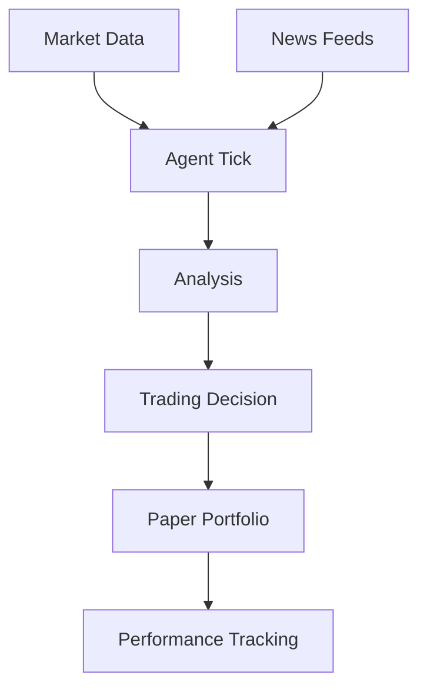

This example shows how to build a trading agent that:
- Monitors cryptocurrency markets
- Forms opinions based on news and data
- Makes paper trading decisions
- Tracks portfolio performance

## Architecture



## Key Components

### Market Data Plugin

```typescript
// plugins/markets.ts
import type { Plugin, TickContext } from "./src";
import type { Agent } from "./src";

interface MarketData {
  symbol: string;
  price: number;
  change24h: number;
  volume: number;
}

export function createMarketsPlugin(config: {
  symbols: string[];
  refreshMinutes: number;
}): Plugin {
  let lastFetch = 0;
  let cachedData: MarketData[] = [];

  return {
    name: "markets",
    version: "1.0.0",

    async init(agent: Agent) {
      // Initial fetch
      cachedData = await fetchMarketData(config.symbols);
      lastFetch = Date.now();
    },

    async onTick(context: TickContext) {
      // Refresh if stale
      if (Date.now() - lastFetch > config.refreshMinutes * 60 * 1000) {
        cachedData = await fetchMarketData(config.symbols);
        lastFetch = Date.now();
      }

      // Log significant market moves
      for (const data of cachedData) {
        if (Math.abs(data.change24h) > 5) {
          console.log(`Significant move: ${data.symbol} ${data.change24h > 0 ? "+" : ""}${data.change24h.toFixed(2)}%`);
        }
      }
    },

    actions: {
      async getMarkets() {
        return { success: true, data: cachedData };
      },

      async getPrice(params: { symbol: string }) {
        const data = cachedData.find(d => d.symbol === params.symbol);
        return { success: true, data: data?.price || null };
      },
    },
  };
}

async function fetchMarketData(symbols: string[]): Promise<MarketData[]> {
  const response = await fetch(
    `https://api.coingecko.com/api/v3/coins/markets?vs_currency=usd&ids=${symbols.join(",")}`
  );
  const data = await response.json();
  return data.map((coin: any) => ({
    symbol: coin.symbol.toUpperCase(),
    price: coin.current_price,
    change24h: coin.price_change_percentage_24h,
    volume: coin.total_volume,
  }));
}
```

### Paper Trading Plugin

```typescript
// plugins/paper-trading.ts
import type { Plugin, TickContext } from "./src";
import type { Agent } from "./src";

interface Position {
  symbol: string;
  amount: number;
  entryPrice: number;
  entryTime: number;
}

interface Portfolio {
  cash: number;
  positions: Position[];
}

export function createPaperTradingPlugin(config: {
  initialCash: number;
  maxPositionPercent: number;
}): Plugin {
  let portfolio: Portfolio = {
    cash: config.initialCash,
    positions: [],
  };

  const executeBuy = (symbol: string, price: number): { success: boolean; amount?: number; reason?: string } => {
    const maxAmount = portfolio.cash * config.maxPositionPercent;
    const amount = maxAmount / price;

    if (amount * price > portfolio.cash) {
      return { success: false, reason: "Insufficient funds" };
    }

    portfolio.cash -= amount * price;
    portfolio.positions.push({
      symbol,
      amount,
      entryPrice: price,
      entryTime: Date.now(),
    });

    console.log(`Bought ${amount.toFixed(4)} ${symbol} at $${price}`);
    return { success: true, amount };
  };

  const executeSell = (symbol: string, price: number): { success: boolean; pnl?: number; reason?: string } => {
    const position = portfolio.positions.find(p => p.symbol === symbol);
    if (!position) {
      return { success: false, reason: "No position" };
    }

    const proceeds = position.amount * price;
    const pnl = proceeds - (position.amount * position.entryPrice);

    portfolio.cash += proceeds;
    portfolio.positions = portfolio.positions.filter(p => p.symbol !== symbol);

    console.log(`Sold ${position.amount.toFixed(4)} ${symbol} at $${price}, PnL: $${pnl.toFixed(2)}`);
    return { success: true, pnl };
  };

  return {
    name: "paper-trading",
    version: "1.0.0",
    dependencies: ["markets"],

    onTick(context: TickContext) {
      // Only trade when expressive and healthy
      if (context.state.mood !== "expressive" || context.state.health < 50) {
        return;
      }

      // Log portfolio status each tick
      const totalValue = portfolio.cash +
        portfolio.positions.reduce((sum, p) => sum + p.amount * p.entryPrice, 0);
      console.log(`Portfolio value: $${totalValue.toFixed(2)}`);
    },

    actions: {
      async getPortfolio() {
        const totalValue = portfolio.cash +
          portfolio.positions.reduce((sum, p) => sum + p.amount * p.entryPrice, 0);

        return {
          success: true,
          data: {
            cash: portfolio.cash,
            positions: portfolio.positions,
            totalValue,
            totalPnL: totalValue - config.initialCash,
          }
        };
      },

      async buy(params: { symbol: string; price: number }, agent: Agent) {
        return executeBuy(params.symbol, params.price);
      },

      async sell(params: { symbol: string; price: number }, agent: Agent) {
        return executeSell(params.symbol, params.price);
      },
    },
  };
}

```

### Complete Agent Setup

```typescript
// agent.ts
import { Agent } from "./src";
import { ConvexBackend } from "./src/backend";
import { createMarketsPlugin } from "./plugins/markets";
import { createPaperTradingPlugin } from "./plugins/paper-trading";

const backend = new ConvexBackend({
  url: process.env.CONVEX_URL!,
});

export const tradingAgent = new Agent({
  backend,
  plugins: [
    createMarketsPlugin({
      symbols: ["bitcoin", "ethereum", "solana"],
      refreshMinutes: 5,
    }),

    createPaperTradingPlugin({
      initialCash: 10000,
      maxPositionPercent: 0.2,  // 20% max per position
    }),
  ],
});

// Execute a tick
await tradingAgent.tick();

// Or start automatic ticks
tradingAgent.start();
```

## Running the Trading Agent

```bash
# Start the agent
npm run dev

# Check portfolio
curl http://localhost:3001/actions/paper-trading/getPortfolio

# Manual trade
curl -X POST http://localhost:3001/actions/paper-trading/buy \
  -H "Authorization: Bearer $TOKEN" \
  -H "Content-Type: application/json" \
  -d '{"symbol": "ETH", "amountUsd": 500}'
```

## Risk Management

This example includes several risk controls:

1. **Position limits**: Max 20% of portfolio per position
2. **Mood gating**: Only trades when expressive and healthy
3. **Confidence threshold**: Requires 0.7+ confidence on thoughts
4. **Paper trading**: No real money at risk

<Warning>
  This is for educational purposes only. Never trade real money based on AI agent decisions without proper risk management and human oversight.
</Warning>

## Next Steps

<CardGroup cols={2}>
  <Card title="Social Agent" icon="users" href="/examples/social-agent">
    Build an agent that engages on social media.
  </Card>
  <Card title="Custom Plugins" icon="plug" href="/guides/custom-plugins">
    Learn to build your own plugins.
  </Card>
</CardGroup>
