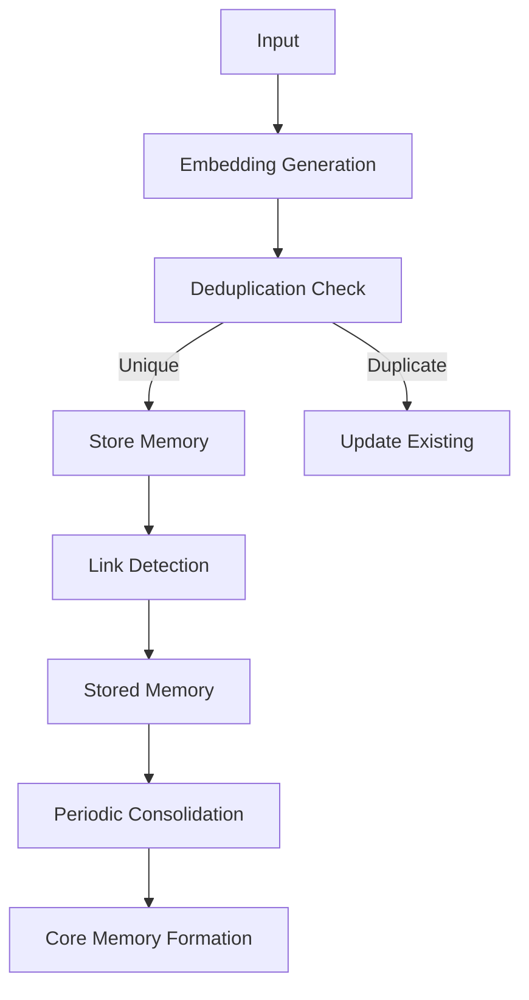

This guide covers memory management strategies for production ClarkOS agents.

<Note>
  This guide documents the full memory system architecture. Some advanced features (semantic search, consolidation, linking) are being ported to the SDK. Check CLAUDE.md for current implementation status.
</Note>

## Memory Lifecycle

Understanding how memories flow through the system:



## Embedding Strategies

### Choosing an Embedding Model

ClarkOS supports multiple embedding providers:

```typescript
const agent = new Agent({
  memory: {
    // Google's text-embedding-004 (recommended)
    embeddingModel: "gemini",
    embeddingDimensions: 768,

    // Or OpenAI
    // embeddingModel: "openai",
    // embeddingDimensions: 1536,
  },
});
```

### Embedding Cache

Reduce API calls with caching:

```typescript
const agent = new Agent({
  memory: {
    embeddingCache: {
      enabled: true,
      maxSize: 500,      // Max cached embeddings
      ttl: 3600000,      // 1 hour TTL
    },
  },
});
```

### Batch Embeddings

For bulk operations:

```typescript
// Efficient batch embedding
const texts = ["memory 1", "memory 2", "memory 3"];
const embeddings = await agent.memory.batchEmbed(texts, {
  batchSize: 10,
  parallelism: 3,
  rateLimit: 100,  // per minute
});
```

## Deduplication Strategies

### Type-Specific Thresholds

The SDK uses type-specific deduplication thresholds (defined in `src/memory/deduplication.ts`):

```typescript
// Default thresholds in the SDK
const DEDUP_THRESHOLDS = {
  episodic: 0.92,    // Events can be similar but distinct
  semantic: 0.95,    // Facts need high similarity to merge
  emotional: 0.88,   // Feelings merge more easily
  procedural: 0.97,  // Patterns need near-exact match
  reflection: 0.90,  // Self-insights should be unique
};
```

You can override these when checking duplication:

```typescript
import { checkDuplication } from "./src/memory/deduplication";

const result = checkDuplication(newMemory, existingMemories, {
  typeThresholds: {
    semantic: 0.90,  // More aggressive semantic dedup
  },
});
```

### Custom Deduplication Logic

Use the SDK's deduplication utilities directly:

```typescript
import {
  checkDuplication,
  findSimilarMemories,
  DEDUP_THRESHOLDS
} from "./src/memory/deduplication";
import { cosineSimilarity } from "./src/llm/embeddings";

// Check if a new memory is a duplicate
const result = checkDuplication(
  { content: "New memory content", type: "semantic", embedding: newEmbedding },
  existingMemories,
  { typeThresholds: DEDUP_THRESHOLDS }
);

if (!result.isUnique) {
  console.log("Duplicate found:", result.reason);
  console.log("Matched memory:", result.matchedMemoryId);
  console.log("Similarity:", result.similarity);
}

// Find similar memories without strict deduplication
const similar = findSimilarMemories(
  { content: "Query", type: "semantic", embedding: queryEmbedding },
  existingMemories,
  { limit: 5, minSimilarity: 0.6 }
);
```

## Importance Scoring

### Automatic Importance Calculation

```typescript
function calculateImportance(memory: NewMemory): number {
  let importance = 0.5;  // Base

  // Boost for entities
  const entityCount = memory.metadata?.entities?.length || 0;
  importance += entityCount * 0.05;

  // Boost for strong sentiment
  const sentiment = Math.abs(memory.sentiment?.score || 0);
  importance += sentiment * 0.1;

  // Boost for certain keywords
  const keywordBoost = containsKeywords(memory.content, [
    "important", "critical", "urgent", "remember",
  ]);
  importance += keywordBoost * 0.15;

  // Cap at 1.0
  return Math.min(importance, 1.0);
}
```

### Importance Decay

Over time, importance fades:

```typescript
const agent = new Agent({
  memory: {
    decay: {
      enabled: true,
      halfLife: 7 * 24 * 60 * 60 * 1000,  // 7 days
      minImportance: 0.1,                   // Floor

      // Exempt certain memories from decay
      exempt: (memory) => {
        return memory.type === "reflection" ||
               memory.importance >= 0.9;
      },
    },
  },
});
```

## Retrieval Optimization

### Get with Filters

```typescript
// Using the memory store directly
const memoryStore = agent.memory;

// Get with filters
const memories = await memoryStore.get({
  type: "semantic",
  limit: 20,
  minImportance: 0.5,
});

// Filter results further
const relevant = memories.filter(m =>
  m.importance > 0.5 &&
  m.tags.some(t => ["news", "research"].includes(t))
);
```

### Semantic Search

```typescript
// Search by text query
const memories = await memoryStore.search({
  query: "ethereum market trends",
  limit: 10,
});
```

### Recency Scoring

```typescript
function recencyScore(memory: Memory, now: number): number {
  const age = now - memory.lastAccessedAt;
  const dayInMs = 24 * 60 * 60 * 1000;

  // Exponential decay
  return Math.exp(-age / (7 * dayInMs));
}
```

### Multi-Type Retrieval

For complex context building:

```typescript
const memoryStore = agent.memory;

// Get by different types
const semanticMemories = await memoryStore.get({ type: "semantic", limit: 10 });
const episodicMemories = await memoryStore.get({ type: "episodic", limit: 10 });
const proceduralMemories = await memoryStore.get({ type: "procedural", limit: 5 });

// Combine and deduplicate by ID
const seen = new Set<string>();
const allMemories = [...semanticMemories, ...episodicMemories, ...proceduralMemories]
  .filter(m => {
    if (seen.has(m.id)) return false;
    seen.add(m.id);
    return true;
  })
  .sort((a, b) => b.importance - a.importance);
```

## Memory Consolidation

<Note>
Memory consolidation is implemented in the CLARK backend but not yet exposed in the base SDK. The patterns below show the target API design.
</Note>

### Consolidation Concept

Consolidation groups related memories into "core memories" - summarized knowledge that represents patterns across many individual memories.

```typescript
interface ConsolidationResult {
  processed: number;
  consolidated: number;
  decayed: number;
}

interface CoreMemory {
  theme: string;
  summary: string;
  insights: string[];
  sourceMemoryIds: string[];
  importance: number;
}
```

### CLARK Backend API

The CLARK demonstration backend exposes consolidation via HTTP:

```bash
# Trigger consolidation
POST /memories/consolidate

# Get core memories
GET /memories/core
```

### Future SDK API

The SDK will expose consolidation with this interface:

```typescript
// Trigger consolidation manually
const result = await agent.memory.consolidate();

console.log(`Processed ${result.processed} memories`);
console.log(`Consolidated ${result.consolidated} memories`);
console.log(`Decayed ${result.decayed} memories`);
```

## Memory Linking

<Note>
Memory linking is implemented in the CLARK backend schema but the detection API is not yet exposed in the base SDK. The schema supports 7 relationship types.
</Note>

### Link Types

The system supports these relationship types:

```typescript
type LinkType =
  | "caused_by"       // Causal relationship
  | "related_to"      // General association
  | "contradicts"     // Conflicting information
  | "elaborates"      // Adds detail
  | "supersedes"      // Replaces old info
  | "temporal_before" // Happened before
  | "temporal_after"; // Happened after
```

### CLARK Backend Schema

Links are stored in the `memory_links` table:

```typescript
// Convex schema
memory_links: defineTable({
  sourceMemoryId: v.string(),
  targetMemoryId: v.string(),
  linkType: v.union(...),
  strength: v.number(),
  confidence: v.number(),
  createdAt: v.number(),
})
```

### Finding Similar Memories (SDK)

While link detection isn't exposed, you can find similar memories:

```typescript
import { findSimilarMemories } from "./src/memory/deduplication";

const similar = findSimilarMemories(
  { content: "Query text", type: "semantic", embedding: queryEmbedding },
  existingMemories,
  { limit: 5, minSimilarity: 0.7 }
);

for (const mem of similar) {
  console.log(`${mem.content} (similarity: ${mem.similarity})`);
}
```

## Memory Maintenance

### Memory Statistics (SDK)

The SDK provides basic statistics:

```typescript
const stats = await agent.memory.getStats();

console.log("Total:", stats.total);
console.log("By type:", stats.byType);
console.log("By scope:", stats.byScope);
console.log("Average importance:", stats.averageImportance);

// Returns:
// {
//   total: 5234,
//   byType: { episodic: 2100, semantic: 1800, emotional: 650, procedural: 400, reflection: 284 },
//   byScope: { short_term: 3000, working: 500, long_term: 1734 },
//   averageImportance: 0.58
// }
```

### Update and Delete (SDK)

```typescript
// Update a memory
await agent.memory.update("memory_id", {
  importance: 0.9,
  tags: ["verified", "important"],
});

// Delete a memory
await agent.memory.delete("memory_id");
```

### Pruning (CLARK Backend)

<Note>
Pruning is implemented in the CLARK backend but not exposed in the base SDK.
</Note>

The CLARK backend provides pruning via the knowledge lifecycle manager:

```typescript
// CLARK backend pattern
import { KnowledgeLifecycleManager } from "./backend/convex/core";

const manager = new KnowledgeLifecycleManager(config);
const result = await manager.prune(items);

console.log(`Pruned ${result.pruned} items`);
console.log(`Kept ${result.kept} items`);
```

## Best Practices

<AccordionGroup>
  <Accordion title="Tune thresholds for your domain">
    - Test with real data before production
    - Monitor false positive/negative rates
    - Adjust per memory type as needed
  </Accordion>

  <Accordion title="Balance memory growth">
    - Set consolidation intervals appropriately
    - Implement pruning for old, low-value memories
    - Monitor storage growth over time
  </Accordion>

  <Accordion title="Use metadata effectively">
    - Always include source information
    - Tag with relevant entities
    - Include context for better retrieval
  </Accordion>

  <Accordion title="Monitor embedding costs">
    - Enable embedding cache
    - Use batch operations when possible
    - Track API usage and costs
  </Accordion>
</AccordionGroup>

## Next Steps

<CardGroup cols={2}>
  <Card title="Consciousness" icon="lightbulb" href="/concepts/consciousness">
    How memories become thoughts.
  </Card>
  <Card title="Deployment" icon="rocket" href="/guides/deployment">
    Deploy your optimized agent.
  </Card>
</CardGroup>
