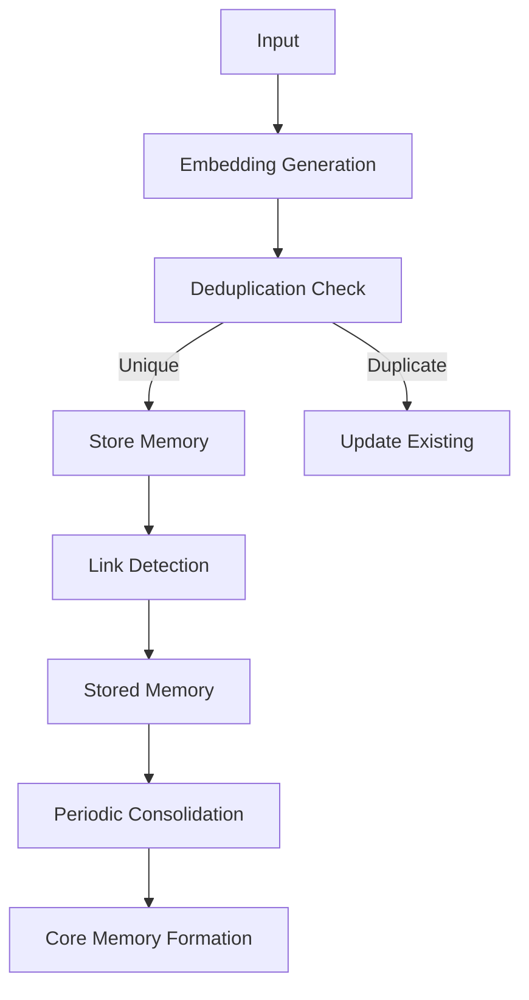

This guide covers memory management strategies for production ClarkOS agents.

<Note>
  This guide documents the full memory system architecture. Some advanced features (semantic search, consolidation, linking) are being ported to the SDK. Check CLAUDE.md for current implementation status.
</Note>

## Memory Lifecycle

Understanding how memories flow through the system:



## Embedding Strategies

### Choosing an Embedding Model

ClarkOS supports multiple embedding providers:

```typescript
const agent = new Agent({
  memory: {
    // Google's text-embedding-004 (recommended)
    embeddingModel: "gemini",
    embeddingDimensions: 768,

    // Or OpenAI
    // embeddingModel: "openai",
    // embeddingDimensions: 1536,
  },
});
```

### Embedding Cache

Reduce API calls with caching:

```typescript
const agent = new Agent({
  memory: {
    embeddingCache: {
      enabled: true,
      maxSize: 500,      // Max cached embeddings
      ttl: 3600000,      // 1 hour TTL
    },
  },
});
```

### Batch Embeddings

For bulk operations:

```typescript
// Efficient batch embedding
const texts = ["memory 1", "memory 2", "memory 3"];
const embeddings = await agent.memory.batchEmbed(texts, {
  batchSize: 10,
  parallelism: 3,
  rateLimit: 100,  // per minute
});
```

## Deduplication Strategies

### Type-Specific Thresholds

Customize deduplication per memory type:

```typescript
const agent = new Agent({
  memory: {
    deduplication: {
      enabled: true,
      thresholds: {
        episodic: 0.92,   // Events can be similar but distinct
        semantic: 0.88,   // Facts should consolidate
        emotional: 0.85,  // Feelings merge more easily
        procedural: 0.90, // Patterns need precision
        reflection: 0.95, // Self-insights should be unique
      },
    },
  },
});
```

### Custom Deduplication Logic

```typescript
const agent = new Agent({
  memory: {
    deduplication: {
      enabled: true,
      customCheck: async (newMemory, existingMemories) => {
        // Find most similar
        const similarities = existingMemories.map(m => ({
          memory: m,
          similarity: cosineSimilarity(newMemory.embedding, m.embedding),
        }));

        const mostSimilar = similarities.sort((a, b) =>
          b.similarity - a.similarity
        )[0];

        // Custom logic: also check metadata
        if (mostSimilar.similarity > 0.9) {
          if (newMemory.metadata.source === mostSimilar.memory.metadata.source) {
            return { isDuplicate: true, existingId: mostSimilar.memory._id };
          }
        }

        return { isDuplicate: false };
      },
    },
  },
});
```

## Importance Scoring

### Automatic Importance Calculation

```typescript
function calculateImportance(memory: NewMemory): number {
  let importance = 0.5;  // Base

  // Boost for entities
  const entityCount = memory.metadata?.entities?.length || 0;
  importance += entityCount * 0.05;

  // Boost for strong sentiment
  const sentiment = Math.abs(memory.sentiment?.score || 0);
  importance += sentiment * 0.1;

  // Boost for certain keywords
  const keywordBoost = containsKeywords(memory.content, [
    "important", "critical", "urgent", "remember",
  ]);
  importance += keywordBoost * 0.15;

  // Cap at 1.0
  return Math.min(importance, 1.0);
}
```

### Importance Decay

Over time, importance fades:

```typescript
const agent = new Agent({
  memory: {
    decay: {
      enabled: true,
      halfLife: 7 * 24 * 60 * 60 * 1000,  // 7 days
      minImportance: 0.1,                   // Floor

      // Exempt certain memories from decay
      exempt: (memory) => {
        return memory.type === "reflection" ||
               memory.importance >= 0.9;
      },
    },
  },
});
```

## Retrieval Optimization

### Semantic Search with Filters

```typescript
// Using the memory store directly
const memoryStore = agent.memory;

// Query with filters
const memories = await memoryStore.query({
  type: "semantic",
  limit: 20,
  minImportance: 0.5,
});

// Filter results further
const relevant = memories.filter(m =>
  m.importance > 0.5 &&
  m.tags.some(t => ["news", "research"].includes(t))
);
```

### Recency Scoring

```typescript
function recencyScore(memory: Memory, now: number): number {
  const age = now - memory.lastAccessedAt;
  const dayInMs = 24 * 60 * 60 * 1000;

  // Exponential decay
  return Math.exp(-age / (7 * dayInMs));
}
```

### Multi-Query Retrieval

For complex context building:

```typescript
const memoryStore = agent.memory;

// Query by different types
const semanticMemories = await memoryStore.query({ type: "semantic", limit: 10 });
const episodicMemories = await memoryStore.query({ type: "episodic", limit: 10 });
const proceduralMemories = await memoryStore.query({ type: "procedural", limit: 5 });

// Combine and deduplicate by ID
const seen = new Set<string>();
const allMemories = [...semanticMemories, ...episodicMemories, ...proceduralMemories]
  .filter(m => {
    if (seen.has(m.id)) return false;
    seen.add(m.id);
    return true;
  })
  .sort((a, b) => b.importance - a.importance);
```

## Memory Consolidation

### Automatic Consolidation

```typescript
const agent = new Agent({
  memory: {
    consolidation: {
      enabled: true,
      interval: 6 * 60 * 60 * 1000,  // Every 6 hours

      // Clustering settings
      clustering: {
        minClusterSize: 3,
        maxClusterSize: 20,
        similarityThreshold: 0.7,
      },

      // Core memory creation
      coreMemory: {
        minConfidence: 0.7,
        maxCoreMemories: 100,
      },
    },
  },
});
```

### Manual Consolidation

```typescript
// Trigger consolidation manually
const result = await agent.memory.consolidate();

console.log(`Processed ${result.memoriesProcessed} memories`);
console.log(`Created ${result.coreMemoriesCreated} core memories`);
console.log(`Decayed ${result.memoriesDecayed} memories`);
```

### Cluster Analysis

```typescript
// Get memory clusters
const clusters = await agent.memory.getClusters({
  minSize: 3,
  threshold: 0.7,
});

for (const cluster of clusters) {
  console.log(`Cluster: ${cluster.theme}`);
  console.log(`  Size: ${cluster.memories.length}`);
  console.log(`  Avg importance: ${cluster.avgImportance}`);
}
```

## Memory Linking

### Automatic Link Detection

```typescript
// Detect links for a new memory
const links = await agent.memory.detectLinks(memoryId);

// Returns detected relationships
// [
//   { targetId: "xxx", type: "related_to", strength: 0.85 },
//   { targetId: "yyy", type: "elaborates", strength: 0.72 },
// ]
```

### Causal Chain Tracking

```typescript
// When storing a memory, include the triggering memory in metadata
const memoryStore = agent.memory;

await memoryStore.store({
  type: "episodic",
  content: "User expressed frustration about slow response",
  scope: "short_term",
  importance: 0.8,
  salience: 0.7,
  valence: -0.3,
  confidence: 0.9,
  tags: ["user-feedback", "negative"],
  sourceType: "interaction",
  metadata: {
    triggerMemoryId: previousMemoryId,
    context: "support_interaction"
  }
});
```

### Contradiction Detection

```typescript
// Check for contradicting memories
const contradictions = await agent.memory.findContradictions(
  "ETH price will increase"
);

// Returns memories with conflicting information
for (const c of contradictions) {
  console.log(`Contradicts: ${c.memory.content}`);
  console.log(`Confidence: ${c.confidence}`);
}
```

## Memory Maintenance

### Pruning Old Memories

```typescript
// Remove low-importance, old memories
const pruned = await agent.memory.prune({
  olderThan: 30 * 24 * 60 * 60 * 1000,  // 30 days
  maxImportance: 0.3,
  excludeTypes: ["reflection", "procedural"],
  dryRun: true,  // Preview first
});

console.log(`Would prune ${pruned.count} memories`);

// Actually prune
await agent.memory.prune({ ...options, dryRun: false });
```

### Memory Statistics

```typescript
const stats = await agent.memory.getStats();

// {
//   total: 5234,
//   byType: {
//     episodic: 2100,
//     semantic: 1800,
//     emotional: 650,
//     procedural: 400,
//     reflection: 284
//   },
//   avgImportance: 0.58,
//   avgConfidence: 0.72,
//   oldestMemory: 1704067200000,
//   newestMemory: 1706400000000,
//   storageSize: "45.2 MB",
//   coreMemories: 89,
//   links: 12450
// }
```

### Health Monitoring

```typescript
// Set up alerts
agent.memory.on("alert", (alert) => {
  switch (alert.type) {
    case "high_memory_count":
      console.warn(`Memory count high: ${alert.count}`);
      break;
    case "low_dedup_rate":
      console.warn(`Low dedup rate: ${alert.rate}%`);
      break;
    case "consolidation_failed":
      console.error(`Consolidation failed: ${alert.error}`);
      break;
  }
});
```

## Best Practices

<AccordionGroup>
  <Accordion title="Tune thresholds for your domain">
    - Test with real data before production
    - Monitor false positive/negative rates
    - Adjust per memory type as needed
  </Accordion>

  <Accordion title="Balance memory growth">
    - Set consolidation intervals appropriately
    - Implement pruning for old, low-value memories
    - Monitor storage growth over time
  </Accordion>

  <Accordion title="Use metadata effectively">
    - Always include source information
    - Tag with relevant entities
    - Include context for better retrieval
  </Accordion>

  <Accordion title="Monitor embedding costs">
    - Enable embedding cache
    - Use batch operations when possible
    - Track API usage and costs
  </Accordion>
</AccordionGroup>

## Next Steps

<CardGroup cols={2}>
  <Card title="Consciousness" icon="lightbulb" href="/concepts/consciousness">
    How memories become thoughts.
  </Card>
  <Card title="Deployment" icon="rocket" href="/guides/deployment">
    Deploy your optimized agent.
  </Card>
</CardGroup>
